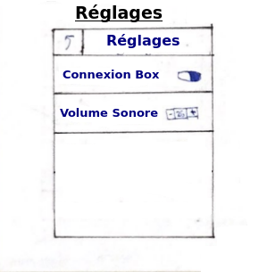

=== Description des interfaces

image::../images/IHMpictures/IHM0.png[]
Cette page est la page d’accueil de l’application. Un appui sur le bouton principal entraı̂nera un basculement vers la page suivante. Il y a possibilité d’en savoir plus sur le principe de fonctionnement et les personnes ayant contribuées au projet en appuyant sur ”à propos de”.

Cette page est la page principale où toutes les options sont disponibles. L’utilisateur pourra reprendre sa lecture, aller dans la bibliothèque, télécharger de nouveaux livres dans ”Librairie”, s’informer sur les ambiances disponibles et enfin modifier certains réglages.

Cette page apparaı̂t lors de l’appui sur ”Reprendre” de la page d’accueuil où bien lors d’une pression sur ”Lire” depuis un livre de ”Ma biblio”. Lorsque la connexion à la box est faite, une ambiance sonore (et/ou olfactive) est délivrée. Hors connexion, les sons sont délivrés depuis le smartphone. Il suffit alors de glisser son doigt sur la page (”slider”) afin de passer à la page suivante. Les icones en haut à droite permettent respectivement de mettre en pause la diffusion sonore/olfactive et de savoir quelle(s) ambiance(s) est/sont jouée(s).

Cette page expose l’ensemble des livres disponibles sur l’application. Une bannière indique si ce dernier a déjà été téléchargé ou non. Il est possible de faire une recherche des livres disponibles en cliquant sur l’icone en haut à droite. De plus, un clic sur une référence ouvre une autre page avec une description plus détaillé.

Suite à l’appui sur une référence de livre, cette page apparaı̂t. Elle décrit le livre avec un résumé et permet de le télécharger.Suite à l’appui sur une référence de livre, cette page apparaı̂t. Elle décrit le livre avec un résumé et permet de le télécharger.

Description de l’ensemble des ambiances que l’application propose, avec possibilité de faire une recherche. De plus, deux boutons en bas permettent de sélectionner le type d’ambiance : sonore ou olfactive. Un appui sur une ambiance sonore la met en lecture, tandis qu’un appui sur une ambiance olfactive permet juste de la décrire (afin de ne pas vider les réserves d’odeurs).

Cette page s’affiche après un clic sur la rubrique ”Ma biblio” depuis l’écran principal. Elle liste l’ensemble des livres téléchargés et prêts à être lu. Le bouton disponilbe à côté du titre permet soit de reprendre la lecture, soit de la commencer.

Cette page apparaı̂t lors de l’appui sur la référence d’un livre depuis la rubrique ”Ma Bibliothèque”. Elle donne un résumé du livre en question, permet de démarrer ou reprendre la lecture, de supprimer le livre (afin de gagner de la place mémoire) et d’utiliser un mode manuel qui permet de gérer soi-même la diffusion d’ambiances.

Lors de l’appui du ”Mode manuel”, cette page apparaı̂t. Il y a alors possibilité de programmer les sons et odeurs pour une durée choisie. Pour ajouter un son/odeur, il suffit de cliquer sur la croix en haut à droite qui redirigera l’application vers la liste des ambiances. Ensuite, il suffira de régler le temps de diffusion.

Les réglages permettent d’informer l’utilisateur sur la connexion de son smartphone avec la box diffuseuse de sons/odeurs. Si la connexion est établie, il pourra gérer le son de celle-ci à sa guise.
