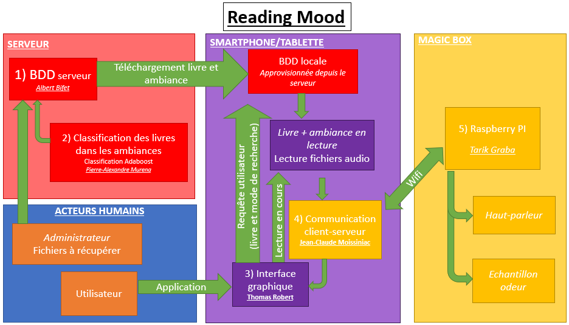

=== Schéma d'architecture

=== Description des blocs

Le projet recouvre quatre environnements : le serveur (cadre rouge), la tablette (cadre violet), la Magic box(cadre jaune) et l’espace utilisateur(cadre bleu).

Au niveau du serveur, une *base de données* contenant les livres, les résultats des calculs (c'est-à-dire le couplage passage analysé-ambiance à produire) fait l’objet d’un premier module. Ce choix de l’ambiance est réalisé par différentes classifications, reposant sur plusieurs méthodes vectorisation des données textuelles pour enfin être améliorées par la méthode de *classification par adaboost*.

De ces résultats découle le son à associer au passage en cours de lecture et éventuellement une odeur. La base de données locale située dans le smartphone est alimentée par celle du serveur dès que l’utilisateur en fait la demande, via *l’interface utilisateur-graphique*. Via l’interface graphique (à savoir ici, l’application Android), l’utilisateur choisit d’utiliser ou non la Magic box. Dans le premier cas, une connexion bluetooth est établie avec celle-ci grâce au module *communication client-serveur*. Une fois la connexion établie, la *Raspberry Pi*, pourra communiquer aux haut-parleurs de la magic box afin de lancer le fichier audio. Cette Raspberry Pi permet aussi de commander un pulvérisateur d’odeurs (une dizaine d’échantillons seulement étant disponible faute de place, seules certaines ambiances feront l’objet d’une pulvérisation olfactive en plus des sons produits). Ce pulvérisateur sera élaboré avec le module Raspberry Pi.

À ces modules viendront évidemment s’ajouter celui de *test et intégration* permettant de mettre le travail du groupe en commun, ainsi que celui de *SES*.

Voic la répartition des binômes

= Base de données
Khaled et Thomas

= Classification par Adaboost
Thierry et Thiziri

= Interface utilisateur-graphique
Clément et Thierry

= Communication client-serveur
Frank et Khaled

= Raspberry pi
Frank et Thomas

= Test et intégration
Clément et Thiziri
