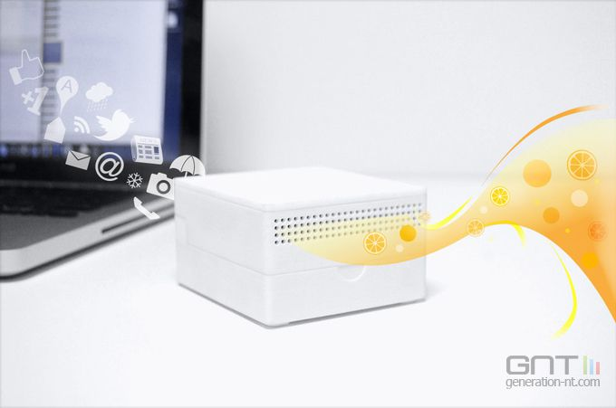

=== Description de l’état de l’art
ifdef::env-gitlab,env-browser[:outfilesuffix: .adoc]

Notre projet consiste en une lecture sur tablette numérique accompagnée par une ambiance sonore et olfactive associée au thème du passage lu.
Notre projet mêle plusieurs produits commercialisés ou de sujets de recherche existants.

=== I- Du papier au smartphone

La révolution numérique a permis à la lecture de se dématérialiser et de revêtir de nouvelles formes à l’aide des liseuses numériques et des ouvrages libres de droit accessibles sur internet. La lecture est donc facilement accessible sur n’importe quelle tablette numérique. Des liseuses existent déjà <<Kindle>> et des applications de lecture aussi (Kindle, Apple Books).

image::../images/ImageEtatArt/kindle.jpg[Kindle,400,500]

=== II- La lecture augmentée

Le roman-transmédia <<InCarnatis>> consiste en une histoire mise en musique, avec des passages en séquences animées en réalité virtuelle. L’expérience de la lecture est révolutionnée en ayant accès aux différents médias. Notre projet, quant à lui, vise à offrir une expérience augmentée de la lecture en créant une ambiance sonore adaptée à tout roman et non seulement à un seul.

=== III- Comprendre le texte

L’analyse lexicale d’un texte est un thème de recherche et certains logiciels sont commercialisés notamment <<WordStat>> . C’est un logiciel permettant entre autre de trier les textes en fonction de leur thème, et de créer des dictionnaires thématiques à l’aide d’algorithmes (naïf de Bayes et voisins à k-proximité).
Il est donc possible de trouver le thème d’un texte à l’aide d’algorithmes. Nous utiliserons néanmoins d’autres méthodes de classification que celles de WordStat. Notamment Adaboost et la méthode de vectorisation tf-idf.

=== IV- Les sens pour de nouvelles expériences

Certains dispositifs visant à diffuser des odeurs à la demande d’un outil numérique existent déjà, notamment Olly <<Olly>>, qui envoie une alerte parfumée lors de l’arrivée d’un message ou d’un mail. <<Scentair>>, quant à lui,  propose des diffuseurs d’odeur sur mesure, adaptés aux besoins de ses clients. Il est donc possible d’acheter des diffuseurs qui réagissent à l’envoi de signaux de la part d’un smartphone. Notre « Magic Box », constituée d’un diffuseur d’odeur et d’une enceinte pourra donc être réalisé car il existe des diffuseurs d’odeur dans le marché. Nous voulons néanmoins construire notre propre diffuseur car les diffuseurs  multi-odeurs connectés par wifi dans le marché sont principalement destinés à des entreprises qui font du marketing olfactif et coûtent trop cher.

